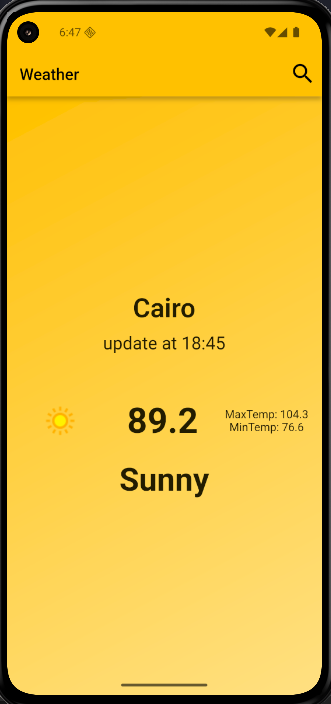

# weather_app

A beautiful and simple Weather App built with **Flutter**, allowing users to get real-time weather information based on location or city name. This app demonstrates clean architecture, API integration, and modern UI principles.


# 🌤️ Flutter Weather App

A beautiful and simple Weather App built with **Flutter**, allowing users to get real-time weather information based on location or city name. This app demonstrates clean architecture, API integration, and modern UI principles.

---
## ⚙️ Features

- 🌍 Get weather data by **current location** or **city name**
- 🌡️ Displays **temperature**, **weather conditions**, **humidity**, **wind speed**, and more
- 📍 Geolocation support using device GPS
- 🔄 Pull-to-refresh weather data
- 🌙 Dark & Light theme support *(if implemented)*
- 🧭 Clean and intuitive UI using Flutter widgets
- 🌐 Integration with **OpenWeatherMap API** or similar

---

## 📱 Screenshots




## 📂 Folder Structure

```plaintext
lib/
├── data/            # Data layer (models, Hive, repositories)
├── domain/          # Business logic (entities, usecases)
└── presentation/    # UI (screens, widgets, state management)
└── main.dart                # App entry point
```

## 🧰 Technologies Used

- [Flutter](https://flutter.dev/)
- [Dart](https://dart.dev/)
- [dio](https://pub.dev/packages/dio)
- [webview_flutter](https://pub.dev/packages/webview_flutter) 
- [News API](https://newsapi.org/)

### Prerequisites

- [Flutter SDK](https://flutter.dev/docs/get-started/install)
- Android Studio / VS Code
- An API key from [NewsAPI.org](https://newsapi.org/) 
## 🛠️ Getting Started

1. Clone the repository:
   ```bash
   git clone https://github.com/kareemAlfara/Weather-app.git
   cd NoteApp
   ```

2. Install dependencies:
   ```bash
   flutter pub get
   ```

3. Generate Hive type adapters :
   ```bash
   flutter packages pub run build_runner build
   ```

4. Run the app:
   ```bash
   flutter run
   ```

---

## 👤 Author

- [Kareem Alfarra](https://github.com/kareemAlfara/)
- LinkedIn: [linkedin.com/in/kareem-elfara](https://www.linkedin.com/in/kareem-elfara-2aa767337/)

---
